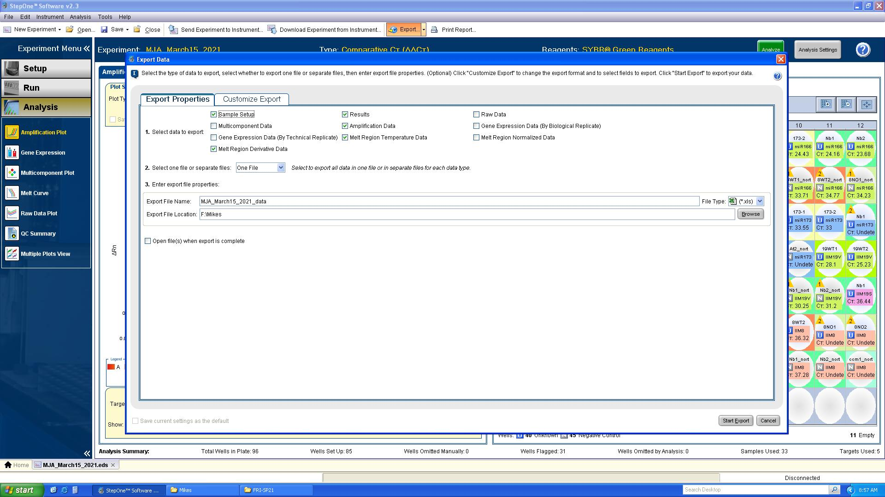

# Summary
This app is designed to analyze .xls files produced by the ABI StepOnePlus real-time PCR instrument. It includes:

- plotting Ct values
- plotting melt curves
- plotting reaction fluorescence curves.
- user-exclusion of false-positive detections.
- analysis using the [Pfaffl et al. 2001](https://www.ncbi.nlm.nih.gov/pubmed/11328886) method of efficiency-corrected relative gene expression.
- downloadable code and tidied data sets to enable customization of plots by the user.

# Install
## On the web at shinyapps.io
The app is hosted at [https://mikeaxtell.shinyapps.io/StepOnePlus/](https://mikeaxtell.shinyapps.io/StepOnePlus/). It is running on a free tier which means limited users and limited CPU time. If it is not available because of these limitations, try the other option below.

## Local in your RStudio
You can run the app locally using [RStudio](https://rstudio.com).

#### Install required packages
You will first need to install the following R packages to your device using the normal R `install.packages()` method:

```
install.packages("shiny")
install.packages("tidyverse")
install.packages("readxl")
install.packages("DT")

```

#### Get and run the source code
Download the source of the latest release from [https://github.com/MikeAxtell/StepOnePlus/releases/latest](https://github.com/MikeAxtell/StepOnePlus/releases/latest). Unpack the Zip file, open the StepOnePlus directory, and click on `App.R`. This should open up the source code in RStudio. The app can then be run locally by clicking the `Run App` button in RStudio.


# Setup
This app depends on a single .xls file produced by the StepOnePlus software. It is crucial to setup the experiment properly **on the StepOnePlus software** before exporting the .xls file, as detailed below.

Note that you can follow this setup procedure either *before* or *after* running the qPCR itself. In other words, if you have older runs that you want to analyze with this app, it is easy to do. You just need to open the original .eds file and follow the steps below.

## Define Targets, Samples, and Biogroups
In this first step we will setup the available names of various entities in the run. This is done in the "Define Targets and Samples" tab of the "Plate Setup" window (Figure 1).


#### Targets
A "target" is the gene/mRNA/microRNA that is being detected. In order to perform proper analysis, there will need to be at least two targets: one which will serve as the reference target (presumed stable accumulation across all conditions), and a variable target.

#### Samples
 A "sample" is the specific tube of template used for the qPCR reaction. Note that negative controls, such as no-reverse-transcriptase (no-RT) controls and no-template controls (NTCs) are *distinct* samples; the template for a no-RT control is a different tube than the yes-RT cDNA, and the template for a NTC reaction is also a different tube (water).

#### Biogroups (AKA "Biological Replicate Groups")
A "Biogroup" or "Biological Replicate Group" is a group of wells where the reactions are all from the same experimental condition. In other words, they are biological replicates. Note that no-RT controls are included in the same Biogroup as their yes-RT counterparts; this is because they both come from the same biological condition.  NTC reactions are in their own Biogroup, because they are their own biological condition (lack of biology actually).

## Assign Targets, Samples, Biogroups and Tasks
Next, each well needs to be assigned to a Target, a Sample, a Biogroup, and a Task. This is done on the "Assign Targets and Samples" tab of the StepOnePlus software. This tab has two different views: "View Plate Layout" (Figure 2) and "View Well Table" (Figure 3). You can use either one, depending on your aesthetic preferences.


#### Tasks
All wells must be marked as a Task of either **Unknown** or **Negative Control**. These are little "U" or "N" buttons in the top-left of the software.

- **Unknown** : Anything that is not a negative control is an unknown. The "Unknown" refers to the fact that a real Ct value is expected.
- **Negative Control** : Reactions that are no-reverse-transcriptase or no-template are Negative Control. If the reactions are perfect, wells with a Task of **Negative Control** should be undetected (no Ct value).

## Analysis
This app does not allow the user to change the Ct threshold or Ct values. Therefore users need to adjust the Ct thresholds and set the Ct values within the StepOnePlus software before creating their .xls file. Users then also need to run / re-run the Analysis.

## Exporting the .xls file
Once all of settings and analyses are done in the StepOnePlus software the user needs to export the data. This needs to be exported as a **single** Excel file with the following tabs included (Figure 4).

- Sample Setup
- Results
- Amplification Data
- Melt Region Temperature Data
- Melt Region Derivative Data

Other data can also be exported, but will have no effect on this app. The five datasets above *must* however be included.



# Using the app

## Inputs

#### Upload Excel file
The first step is to upload your Excel file, using the button on the upper left.

#### Choose plot type
There are four plot types available; these radio buttons toggle between them. They are explained in more detail below in "Plot types".

#### Choose wells to mark as undetected for analysis
This option allows the user to mark certain wells as "Undetected" even though they have a Ct value. This is used to mark certain reactions as "bad" .. for instance when it is clear from the melt curve that a Ct value results from a primer-dimer of some other artifact and should instead be considered "undetected. Wells that the user marks as "undetected" will be omitted on the "Analysis" plot type.

Only certain wells are eligible to be marked by the user as "Undetected":

- Must have a Task of "Unknown" (Wells with a Task of "Negative Control" are **all** marked as "Undetected", no matter their Ct value).
- Must have a numeric Ct value (Wells that have no Ct value at all are **all** automaotically marked as "Undetected")

#### Adjust aesthetic mappings
All plot types except "Analysis" allow the user to adjust the aesthetic mappings of the data (linetypes, colors, shapes).

#### Select Wells to Plot
All plot types except "Analysis" allow the user to select / deselect display of any wells in the plots. Upon loading, all wells are selected and thus displayed on the plot. Click a row to deselect/select, and the plot will update accordingly. You can use the usual tricks with the Shift and Ctl buttons to select / de-select multiple wells at once, as well as the sorting and search functions of the table.

#### Analysis Settings
When running an analysis plot there are multiple settings - see the "Analysis Plots" section below for details

## Plot Types

### deltaRn by Cycle
This shows the log10 (deltaRn) values as a function of PCR cycles. Ct values are indicated by black dots. The aesthetic mappings of `Linetype` and `Color` are user-adjustable via the radio buttons on the left. The plotted wells can be adjusted using the `Select Wells to Plot` table.

### Ct values
This shows the Ct values as a function of the Biogroup Names. Wells with no Ct values are not plotted. Users can adjust the aesthetic mappings of `Shape` and `Color` using the radio buttons. The plotted wells can be adjusted using the `Select Wells to Plot` table.

### Melt Curve
This plot shows the melt derivative as a function of temperature. The aesthetic mappings of `Linetype` and `Color` are user-adjustable via the radio buttons on the left. The plotted wells can be adjusted using the `Select Wells to Plot` table.

### Analysis
This plots the expression of a variable Target relative to a reference Target scaled to the median value in a designated Reference Biogroup. It uses the efficiency-corrected relative expression formula described by [Pfaffl et al. 2001](https://www.ncbi.nlm.nih.gov/pubmed/11328886) with some very minor tweaks. The formula is shown in Figure 5:


Where:

- R : Relative Expression
- Ev : Efficiency of the Variable Target
- Er : Efficiency of the Reference Target
- Ct_v.m : Median Ct value of the Variable Target in the Reference Biogroup
- Ct_v.x : Ct value of Variable Target in a given well.
- Ct_r.m : Median Ct value of the Reference Target in the Reference Biogroup
- Ct_r.x : Ct value of Reference Target in a given well.

In cases where a Variable Target was not detected and has no Ct value, the formula can't mathematically be computed. However, this is a non-detect event, so the app forces R to be 0 in those cases.

Similarly, if the user has marked a Variable Target well as "Undetected", the relative expression will be returned as 0.

If a Ct value of a Reference Target is not available, either because it was truly Undetected, or because it was manually marked as "Undetected" by the user, the relative expression will be returned as 'NA'. This is because without a Reference Target detection no assessment of relative expression can be made.

#### Adjust analysis settings

- Reference Target : Set the target to be used as the stable, "housekeeping" reference.
- Variable Target : Set the target to be analyzed as the variable.
- Reference Biogroup : Set the Biogroup that will be used as the "normal" for the analysis. All of the relative expression values will be centered around the median of the Reference Biogroup, which is set at 1.
- Efficiencies: Enter the PCR efficiencies for the Reference Target and Variable Targets. By default these are assumed to be 2 (*e.g.* 100% efficiency). For the most accurate results, the efficiencies of each target reaction should calculated using a serial dilution.
- "Select analysis plot type" : Toggles between a regular plot and a log2-transformed plot.

#### log2 Pseudoplotting

Log-transformation of zero is undefined, so cases where the relative expression is 0 can't be accurately plotted on a log2 scale. However, we do want to know that such data points exist. This app will "pseudoplot" these cases with an arbitraily low y-axis value. The pseudoplotted values are -4 relative to the lowest "real" log2 values on the plot. They are also clearly marked as pseudoplotted.

## Downloading tidied data and code

The app allows the user to download the tidied data and R code for the plot it is currently displaying. The data is a simple .csv (comma separated values) file.

Note that the data downloaded is only for the currently shown plot. If the user has filtered out some of the wells, those data are also filtered from the current data download.
